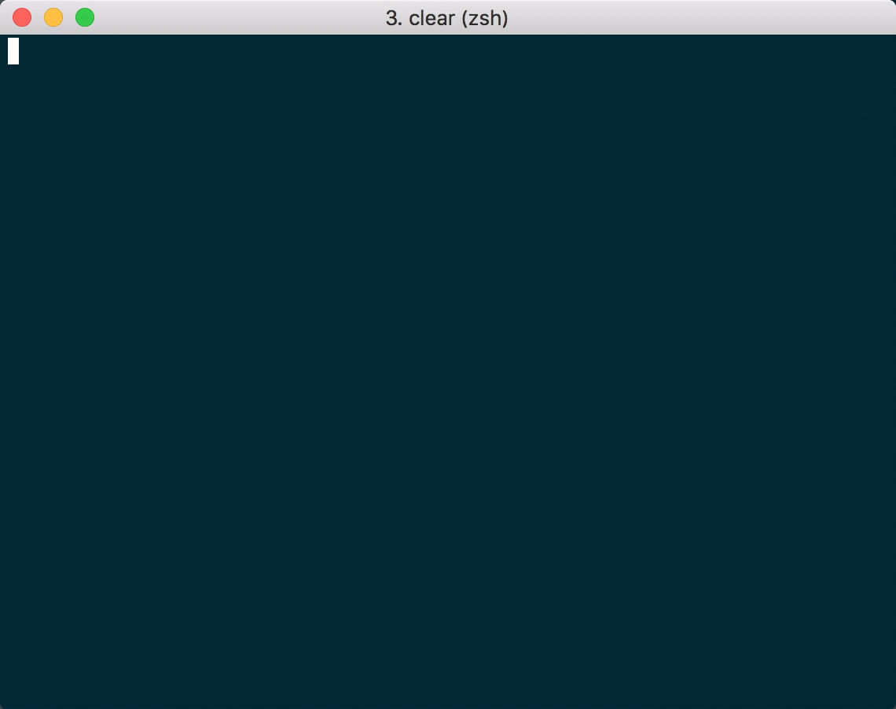
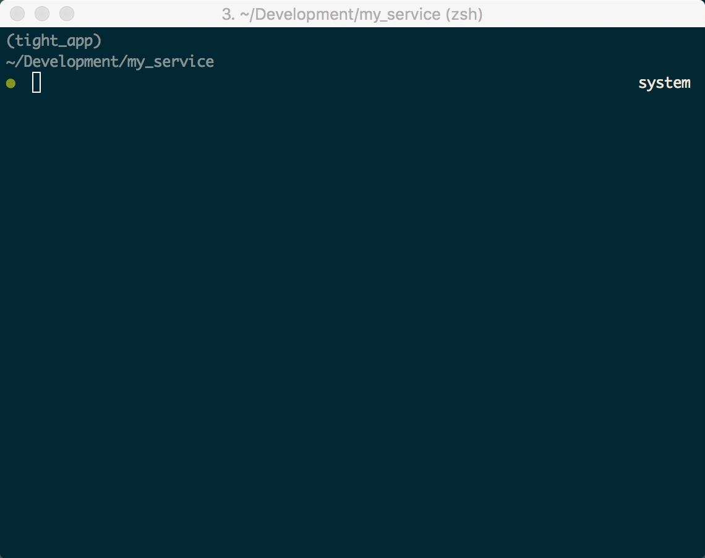

.. _overview:

############
Introduction
############

Tight is a microframework created and optimized for serverless runtimes. With ``tight-cli`` and ``tight`` you can quickly scaffold serverless applications that are conventional, testable-by-default and free of boilerplate.

**Tight currently supports AWS Lambda and the Python2.7 runtime.**

********
Overview
********

The modules provided by ``tight`` make it easy to write lambda functions that act as REST resource controllers. Simply author your function, following Tight's conventional naming and directory schemes (don't worry, ``tight-cli`` can generate these files and directories for you!):

*my_app/app/functions/my_controller/handler.py*:

.. sourcecode:: python

    import tight.providers.aws.controllers.lambda_proxy_event as lambda_proxy

    @lambda_proxy.get
    def get_handler(*args, **kwargs):
        return {
            'statusCode': 200,
            'body': {
                'hello': 'world'
            }
        }

    @lambda_proxy.post
    def post_handler(*args, **kwargs):
        event = kwargs.pop('event')
        # Process request event...
        # ...
        return {
            'statusCode': 201,
        }

    @lambda_proxy.put
    def put_handler(*args, **kwargs):
        event = kwargs.pop('event')
        return {
            'statusCode': 200,
        }

    @lambda_proxy.patch
    def patch_handler(*args, **kwargs):
        pass

    @lambda_proxy.delete
    def delete_handler(*args, **kwargs):
        pass

Import and run a ``tight`` app (as generated by ``tight generate app my_app``:

*my_app/app_index.py:*

.. sourcecode:: python

    # Project structure generated by `tight generate app my_app`
    # Dependencies installed by running `tight pip install --requirements`
    from app.vendored.tight.providers.aws.lambda_app import app as app
    app.run()

And call the controller on the module defined by *app_index.py*:

.. sourcecode:: bash

    app_index.my_controller

And as mentioned the ``tight-cli`` command line tool will scaffold services, functions with test stubs and much more!

*Create an application:*

*Create functions with tests:*

***********************
Motivation & Philosophy
***********************

Tight is inspired by tools and frameworks such as Sinatra, Ember, Flask, Chalice, and Serverless – to name just a few. Tight aspires to help you and your team build servereless applications in a repeatable and conventional manner. To achieve this goal Tight provides two distinct packages: `tight <https://github.com/michaelorionmcmanus/tight>`_ and `tight-cli <https://github.com/michaelorionmcmanus/tight-cli>`_.

The core package, `tight <https://github.com/michaelorionmcmanus/tight>`_, provides modules that map request events to REST style resource handlers – this makes it easy to author declarative resource controllers that group method handlers logically and legibly. Additional modules help you interact with external services, like DynamoDb, in an intuitive and fluent manner. Finally, a suite of test helpers makes it easy to record and simulate HTTP requests and AWS SDK calls.

The Tight command line tool, `tight_cli <https://github.com/michaelorionmcmanus/tight-cli>`_, helps you quickly scaffold and test Tight applications and functions. The tutorials walk through every ``tight-cli`` command and will demonstrate how to:

 * Generate application directories and files
 * Generate functions and tests
 * Install and manage application dependencies
 * Install, configure, and run a local instance of DynamoDb.

The ``tight-cli`` package does the dirty work of preparing your application for predictable and hassle-free deployments. With ``tight-cli`` you can easily generate CloudFormation compatible DynamoDb schemas from application model definitions as well as create deployable artifacts that can be used with a variety of deployment strategies. Tight does not make assumptions or prescriptions about which approach you and your team follow; Tight apps can be deployed directly through the AWS console or in conjunction with other tools and services.

Tight doesn't try to enforce a specific application deployment process, rather it allows you to get your application to a deployable state quickly and in a convention-over-configuration manner. This is where Tight differs with existing serverless-specific tools like Serverless, Chalice, Gordon and Zappa. Another significant divergence from other frameworks and tools (all of which have inspired Tight in some way!) is that Tight doesn't provide a mechanism to invoke or run applications locally via a development server or some other "simulated" service. This is because Tight makes writing tests *easy* which in turn makes building resilient apps and services approachable and frictionless.

***************
Getting Started
***************

The best way to get started with Tight is to follow the `tutorial <tutorial.html>`_, which will guide you through the process of building and deploying an app. There are also references for both `tight <tight_reference.html>`_ and `tight-cli <reference.html>`_.